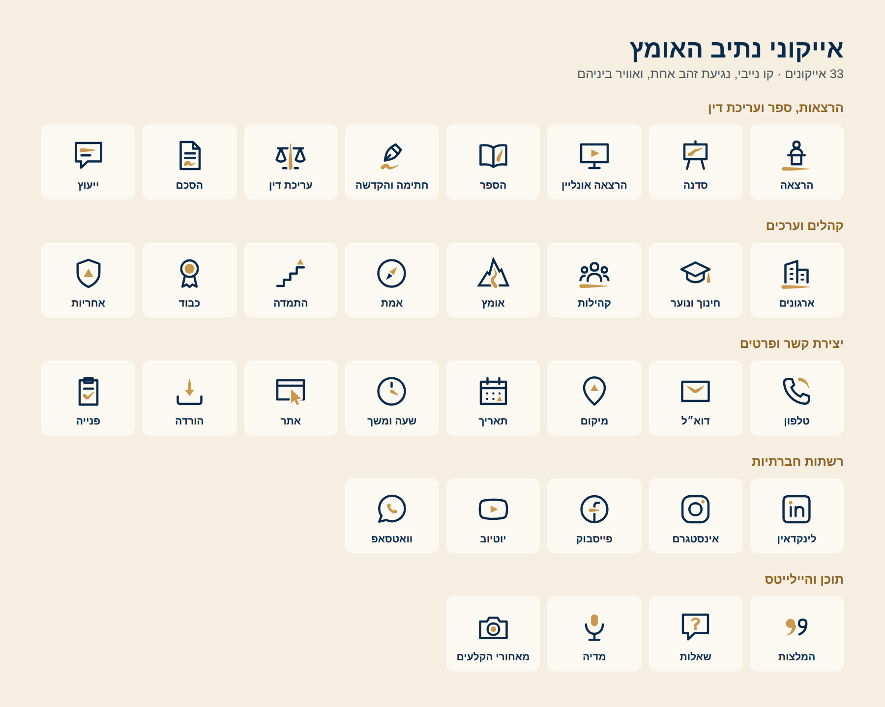

# אייקוני נתיב האומץ

33 אייקונים בשפת הלוגו. כל אייקון הוא קו נייבי עם נגיעת זהב אחת (הדרך, פסגה או נקודה), ובין הזהב לנייבי תמיד יש אוויר, כמו בלוגו.
תצוגה של כל הסט, עם חיפוש והעתקת קוד: `index.html`. הכללים המלאים בספר המותג, בפרק 6 "אייקונים".



## מה יש בתיקייה

```
icons/
├── svg/              צבע: נייבי וזהב (לאתר, לפיגמה, ל-PowerPoint)
├── svg-reversed/     לרקע נייבי או כהה: קלף וזהב בהיר
├── svg-mono/         צבע אחד, יורש את צבע הטקסט (currentColor)
├── png/              512px שקוף, למצגות ולכל תוכנה
├── png-reversed/     512px שקוף, לרקע כהה
├── highlights/       כיסויים להיילייטס באינסטגרם (1080x1920): navy/ ו-parchment/
├── nv-icons.svg      ספרייה לאתר (SVG sprite)
├── icons.css         גדלים וצבעים
├── icons.json        כל האייקונים עם שם, קבוצה, מילות חיפוש וצורות
├── index.html        תצוגה, חיפוש והעתקת קוד
└── netiv-icons.zip   הכל בקובץ אחד
```

## האייקונים

| קבוצה | אייקונים |
|---|---|
| הרצאות, ספר ועריכת דין | `lecture` הרצאה · `workshop` סדנה · `online` הרצאה אונליין · `book` הספר · `signing` חתימה והקדשה · `law` עריכת דין · `contract` הסכם · `consult` ייעוץ |
| קהלים וערכים | `organizations` ארגונים · `education` חינוך ונוער · `community` קהילות · `courage` אומץ · `truth` אמת · `perseverance` התמדה · `respect` כבוד · `responsibility` אחריות |
| יצירת קשר ופרטים | `phone` טלפון · `email` דוא״ל · `location` מיקום · `calendar` תאריך · `time` שעה ומשך · `website` אתר · `download` הורדה · `form` פנייה |
| רשתות חברתיות | `linkedin` לינקדאין · `instagram` אינסטגרם · `facebook` פייסבוק · `youtube` יוטיוב · `whatsapp` וואטסאפ |
| תוכן והיילייטס | `testimonials` המלצות · `qa` שאלות · `media` מדיה · `backstage` מאחורי הקלעים |

## באתר

```html
<link rel="stylesheet" href="/brand/icons/icons.css">
<svg class="nv-icon" aria-hidden="true"><use href="/brand/icons/nv-icons.svg#nv-i-lecture"></use></svg>
```

- הקו מקבל את צבע הטקסט. הזהב לוקח את `--nv-icon-accent`, ואם הוא לא מוגדר את `--nv-path` מ-`tokens.css`, כך שבמצב לילה הוא עובר לבד לזהב הבהיר.
- גדלים: `nv-icon--20` · `--24` (ברירת מחדל) · `--32` · `--48` · `--64`.
- צבע: `nv-icon--on-dark` לרקע נייבי, `nv-icon--mono` לצבע אחד, `nv-icon--brand` לקו נייבי גם בתוך קישור צבעוני.
- הקובץ `nv-icons.svg` צריך להיות באותו דומיין כמו האתר (דפדפנים חוסמים `<use>` מדומיין אחר).
- אייקון שעומד לבד בתוך קישור או כפתור: התווית הולכת לקישור (`aria-label="אינסטגרם"`), והאייקון נשאר `aria-hidden`.

## כללים

- רשת של 24, שוליים של 2, קו של 1.5. זהב אחד בכל אייקון, אף פעם לא צמוד לנייבי.
- גודל מינימלי: 20px. מתחת לזה, או בהטבעה ובחותמת גומי: הגרסה בצבע אחד.
- על משטח זהב: רק צבע אחד. על צילום: הגרסה לרקע כהה, על אזור שקט בתמונה.
- לא מוסיפים זהב שני, לא משנים עובי קו, לא מסובבים ולא מוסיפים צל.
- אייקוני הרשתות החברתיות מעוצבים בשפת המותג, לאתר ולמצגות. במקומות שבהם הפלטפורמה דורשת את הלוגו הרשמי שלה (שותפויות, פרסום ממומן, חומרים מודפסים של אירוע), משתמשים בלוגו הרשמי ובצבע אחד.

## היילייטס באינסטגרם

הכיסויים בגודל סטורי (1080x1920), והאייקון במרכז, בתוך העיגול שאינסטגרם חותך. שתי גרסאות: `navy/` (רקע נייבי) ו-`parchment/` (רקע קלף). כדאי לבחור אחת ולהשתמש רק בה.
העלאה: בפרופיל, לחיצה ארוכה על ההיילייט ← עריכה ← עריכת תמונת כיסוי ← בחירה מהגלריה.

| קובץ | שם מוצע להיילייט |
|---|---|
| `01-lectures.png` | הרצאות |
| `02-book.png` | הספר |
| `03-workshops.png` | סדנאות |
| `04-testimonials.png` | המלצות |
| `05-law.png` | עריכת דין |
| `06-media.png` | מדיה |
| `07-qa.png` | שאלות |
| `08-backstage.png` | מאחורי הקלעים |
| `09-events.png` | אירועים |
| `10-contact.png` | יצירת קשר |
